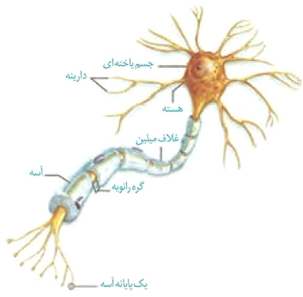
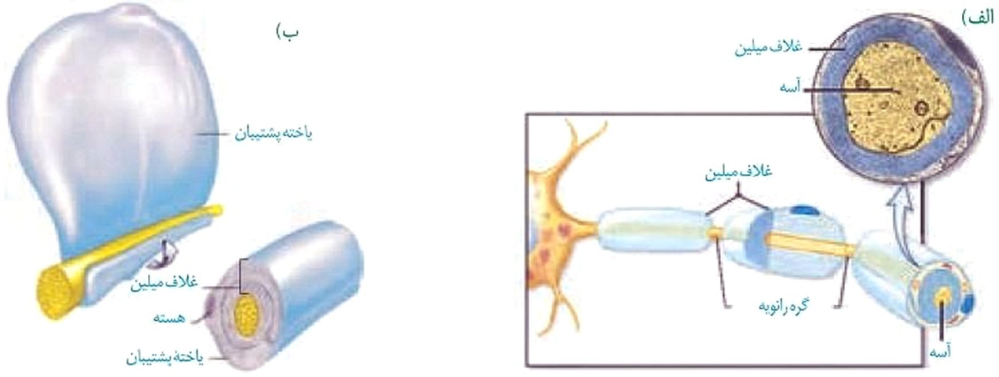
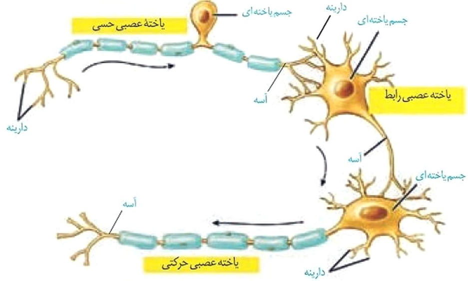
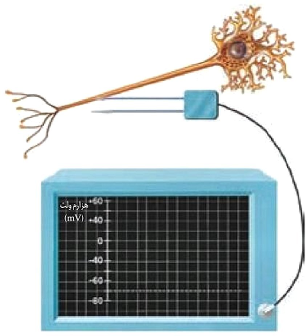
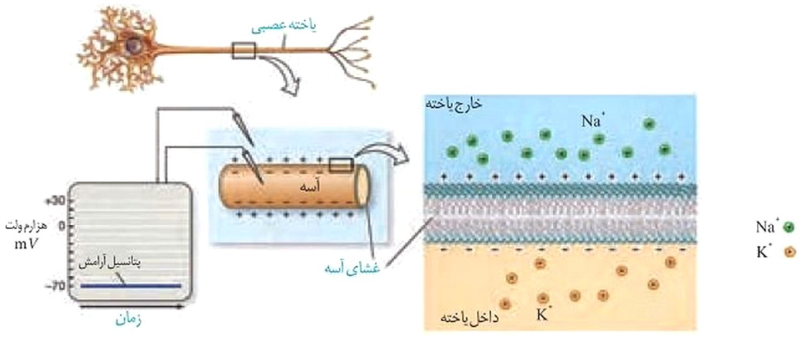
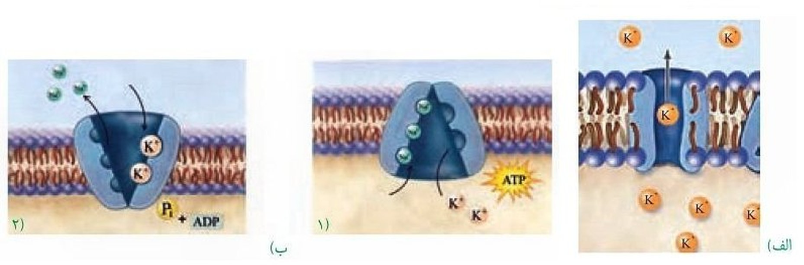
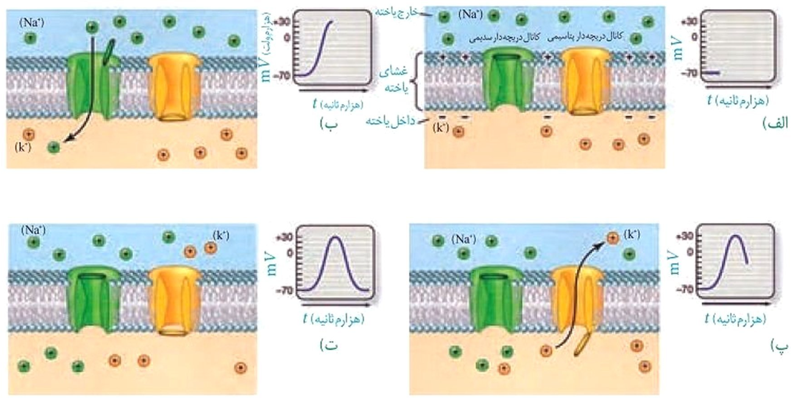
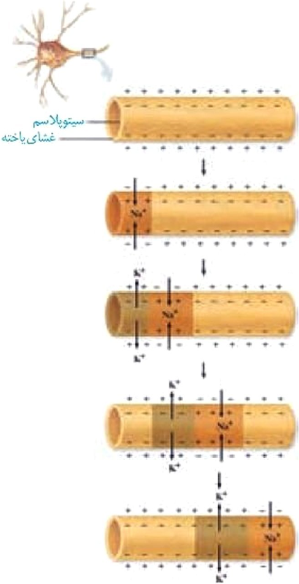
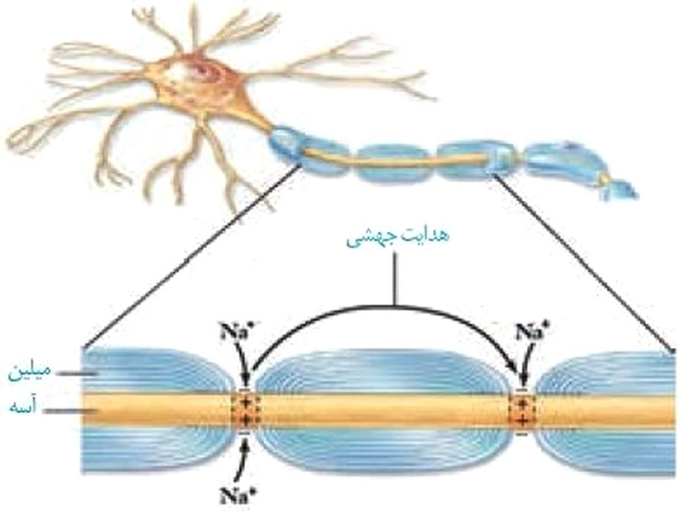
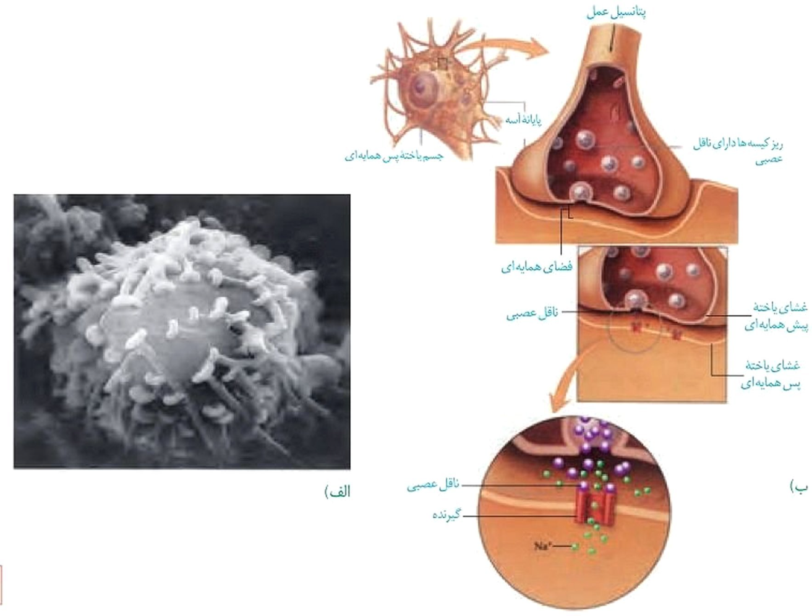

# گفتار 1 - یاخته‌های بافت عصبی

می‌دانید بافت عصبی از
یاخته‌های عصبی و یاخته‌های پشتیبان (نوروگلیاها) تشکیل
شده است. شکل ۱، یک یاختۀ عصبی را نشان می‌دهد. این یاختۀ عصبی از چه
بخش‌هایی تشکیل شده است؟یاخته‌های عصبی سه
عملکرد دارند: این یاخته‌ها تحریک‌پذیرند و پیام عصبی
تولید می‌کنند؛ آن‌ها این پیام را هدایت و به یاخته‌های دیگر
منتقل می‌کنند.دارینه (دندریت)
رشته‌ای است که پیام‌ها را دریافت و به جسم یاختۀ عصبی وارد می‌کند.
آسه (آكسون) رشته‌ای است که پیام عصبی را از جسم یاختۀ عصبی تا
انتهای خود که پایانۀ آسه نام دارد، هدایت می‌کند. پیام عصبی
از محل پایانۀ آسه یک یاختۀ عصبی به یاختۀ دیگر منتقل می‌شود. جسم
یاخته‌ای محل قرار گرفتن هسته و انجام سوخت‌وساز یاخته‌های عصبی است و
می‌تواند پیام نیز دریافت کند. یاختۀ عصبی که در شکل ۱ می‌بینید،
پوششی به نام غلاف میلین دارد.غلاف میلین، رشته‌های
آسه و دارینۀ بسیاری از یاخته‌های عصبی را می‌پوشاند و آن‌ها را
عایق‌بندی می‌کند. غلاف میلین پیوسته نیست و در بخش‌هایی از رشته قطع
می‌شود. این بخش‌ها را گره رانویه می‌نامند که با نقش آن‌ها در
ادامۀ درس، آشنا خواهید شد.شکل ۱- یاختۀ عصبیغلاف میلین را یاخته‌های پشتیبان بافت
عصبی می‌سازند. شکل ۲ را ببینید، یاختۀ پشتیبان به دور رشتۀ عصبی
می‌پیچد و غلاف میلین را به وجود می‌آورد.تعداد یاخته‌های
پشتیبان چند برابر یاخته‌های عصبی است و انواع گوناگونی دارند. این
یاخته‌ها داربست‌هایی را برای استقرار یاخته‌های عصبی ایجاد می‌کنند؛
آن‌ها در دفاع از یاخته‌های عصبی و حفظ هم‌ایستایی مایع اطراف آن‌ها
(مثل حفظ مقدار طبیعی یون‌ها) نیز نقش دارند.شکل ۲- الف) غلاف میلین ب) چگونگی ساخت آن
## انواع یاخته‌های عصبی

شکل 3، انواع یاخته‌های
عصبی را نشان می‌دهد. یاخته‌های عصبی‌ حسی پیام‌ها را به سوی
بخش مرکزی دستگاه عصبی (مغز و نخاع) می‌آورند. یاخته‌های عصبی
حرکتی پیام‌ها را از بخش مرکزی دستگاه عصبی به سوی اندام‌ها
(مانند ماهیچه‌ها) می‌برند. نوع سوم یاخته‌های عصبی شکل ۳،
یاخته‌های عصبی رابط‌اند که در مغز و نخاع قرار دارند. این
یاخته‌ها ارتباط لازم بین یاخته‌های عصبی را فراهم می‌کنند. هر سه نوع
یاخته عصبی می‌توانند میلین‌دار یا بدون میلین باشند.واژه‌شناسیآسه (axon/آكسون) هر دو کلمه به معنی محور است. آسه از کلمه آس گرفته شده است که به محور سنگ آسیا گفته می‌شود.دارینه (dendrite/دندریت) هر دو کلمه به معنی درخت و درخت‌وار است. دارینه از کلمه‌ دار به معنی درخت و (ينه) که پسوند شباهت است ساخته شده که در کل، آنچه شبیه درخت است معنی می‌دهد.شکل ۳- انواع یاخته‌های عصبیفعّالیت ۱ساختار و کار سه نوع یاختۀ عصبی را که در شکل ۳ می‌بینید، مقایسه کنید.
### پیام عصبی

چگونه ایجاد می‌شود؟
پیام عصبی در اثر تغییر
مقدار یون‌ها در دو سوی غشای یاختۀ عصبی به وجود می‌آید. از آنجا که
مقدار یون‌ها در دو سوی غشا، یکسان نیستند، بار الکتریکی دو سوی غشای
یاختۀ عصبی، متفاوت است و در نتیجه بین دو سوی آن، اختلاف پتانسیل
الکتریکی وجود دارد. شکل ۴، اندازه‌گیری این اختلاف پتانسیل را نشان
می‌دهد.شکل ۴- اندازه‌گیری اختلاف پتانسیل الکتریکی دو سوی غشای یاختۀ عصبیپتانسیل آرامش: وقتی
یاختۀ عصبی فعالیت عصبی ندارد (حالت آرامش)، در دو سوی غشای آن اختلاف
پتانسیلی در حدود −۷۰ میلی‌ولت برقرار است (شکل۵). این اختلاف پتانسیل
را پتانسیل آرامش می‌نامند. چگونه این اختلاف پتانسیل ایجاد
می‌شود؟ برای پاسخ به این پرسش، دربارۀ یاخته‌های عصبی باید بیشتر
بدانیم.شکل ۵- پتانسیل آرامش. در شکل، یون‌های پتاسیم در بیرون و یون‌های سدیم در درون نشان داده نشده‌اند.در حالت آرامش، مقدار
یون‌های سدیم در بیرون غشای یاخته‌های عصبی زنده از داخل آن بیشتر است
و در مقابل، مقدار یون‌های پتاسیم درون‌یاخته، از بیرون آن بیشتر است.
در غشای یاخته‌های عصبی، مولکول‌های پروتئینی وجود دارند که به عبور
یون‌های سدیم و پتاسیم از غشا کمک می‌کنند.یکی از این پروتئین‌ها،
کانال‌های نشتی هستند که یون‌ها می‌توانند به روش انتشار تسهیل
شده از آن‌ها عبور کنند (شکل ۶-الف). از راه این کانال‌ها، یون‌های
پتاسیم، خارج و یون‌های سدیم به درون‌ یاختۀ عصبی وارد می‌شوند. تعداد
یون‌های پتاسیم خروجی بیشتر از یون‌های سدیم ورودی است؛ زیرا غشا به
این یون، نفوذپذیری بیشتری دارد.پمپ سدیم - پتاسیم، پروتئین دیگری است که در
سال گذشته با آن آشنا شدید. در هر بار فعالیت این پمپ، سه یون سدیم از
یاختۀ عصبی خارج و دو یون پتاسیم وارد آن می‌شوند. این پمپ از انرژی
مولکول ATP استفاده می‌کند (شکل ۶-ب).شکل ۶- الف) کانال نشتی که عبور یون‌های پتاسیم از آن نشان داده شده است. ب) چگونگی کار پمپ سدیم- پتاسیمفعّالیت ۲در گروه خود دربارۀ پرسش‌های زیر گفت‌وگو و نتیجه را به کلاس گزارش کنید.١- کار پمپ سدیم - پتاسیم و کانال‌های نشتی را با هم مقایسه کنید.۲- چرا در حالت آرامش، بار مثبت درون‌یاخته‌های عصبی از بیرون آن‌ها کمتر است؟پتانسیل عمل: دانستید که در حالت آرامش، بار
مثبت درون یاختۀ عصبی از بیرون آن کمتر است. وقتی یاختۀ عصبی تحریک می‌شود،
در محل تحریک، اختلاف پتانسیل دو سوی غشای آن به‌طور ناگهانی تغییر
می‌کند؛ داخل یاخته از بیرون آن، مثبت‌تر می‌شود و پس از زمان کوتاهی،
اختلاف پتانسیل دو سوی غشا، دوباره به حالت آرامش برمی‌گردد. این
تغییر را پتانسیل عمل می‌نامند. هنگام پتانسیل عمل، در یاختۀ
عصبی چه اتفاقی می‌افتد؟در غشای یاخته‌های
عصبی، پروتئین‌هایی به نام کانال‌های دریچه‌دار وجود دارند که
با تحریک یاختۀ عصبی باز می‌شوند و یون‌ها از آن‌ها عبور می‌کنند.
وقتی غشای یاخته تحریک می‌شود، ابتدا کانال‌های دریچه‌دار
سدیمی باز می‌شوند و یون‌های سدیم فراوانی وارد یاخته و بار
الکتریکی درون آن، مثبت‌تر می‌شود. پس از زمان کوتاهی این کانال‌ها
بسته می‌شوند و کانال‌های دریچه‌دار پتاسیمی باز و
یون‌های پتاسيم خارج می‌شوند. این کانال‌ها هم پس از مدت کوتاهی بسته
می‌شوند (شكل ۷). به این ترتیب، دوباره پتانسیل غشا به پتانسیل آرامش
(−۷۰) برمی‌گردد.فعالیت بیشتر پمپ سدیم
- پتاسیم موجب می‌شود غلظت یون‌های سدیم و پتاسیم در دو سوی غشا
دوباره به حالت آرامش بازگردد.بیشتر بدانیددر دهۀ ۱۹۵۰ دو دانشمند به نام‌های هاجکین[1](#endnote-1569066463458) و هاکسلی[2](#endnote-1569066499698) برای بررسی تغییرات الکتریکی غشای یاختۀ عصبی از آسۀ قطور نرم‌تن مرکب استفاده کردند. آنان پتانسیل الکتریکی غشای آسه را اندازه‌گیری و ترکیب شیمیایی درون آسه و اثر یون‌های سدیم و پتاسیم بر فعالیت‌های الکتریکی آن را نیز بررسی کردند. حاصل کار آن‌ها یافته‌های جدیدی دربارۀ عملکرد غشای تحریک‌پذیر یاختۀ عصبی به دنیای علم عرضه و جایزه نوبل رشته فیزیولوژی- پزشکی سال ۱۹۶۳ را نصیب این دانشمندان کرد.شكل ۷- چگونگی ایجاد پتانسیل عمل؛ در شکل یون‌های پتاسیم بیرون و یون‌های سدیم درون یاخته، نشان داده نشده‌اند.
فعّالیت 3وضعیت کانال‌های غشای یاختۀ عصبی را در ۴ مرحلۀ شكل ۷ مقایسه کنید.وقتی پتانسیل عمل در یک
نقطه از یاختۀ عصبی ایجاد می‌شود، نقطه به نقطه پیش می‌رود تا به
انتهای رشتۀ عصبی برسد. این جریان را پیام عصبی می‌نامند (شکل
۸). رشته عصبی آسه یا دارينۀ بلند است.شکل ۸- هدایت پیام عصبی
## گره‌های

رانویه چه نقشی دارند؟
هدایت پیام عصبی در
رشته‌های عصبی میلین‌دار از رشته‌های بدون میلین هم‌قطر سریع‌تر است؛
درحالی‌که میلین عایق است و از عبور یون‌ها از غشا جلوگیری می‌کند.
دانستید در یاخته‌های عصبی میلین‌دار، گره‌های رانویه وجود دارد. در
محل این گره‌ها، میلین وجود ندارد و رشتۀ عصبی با محیط بیرون از یاخته
ارتباط دارد. بنابراین، در این گره‌ها پتانسیل عمل ایجاد می‌شود و
پیام عصبی درون رشتۀ عصبی از یک گره به گره دیگر هدایت می‌شود. در این
حالت به نظر می‌رسد پیام عصبی از یک گره به گره دیگر می‌جهد. به همین
علت، این هدایت را هدایت جهشی می‌نامند (شکل ۹). در ماهیچه‌های
اسکلتی سرعت ارسال پیام اهمیت زیادی دارد. بنابراین، نورون‌های حرکتی
آن‌ها میلین‌دار است. کاهش یا افزایش میزان میلین به بیماری منجر
می‌شود؛ مثلاً در بیماری ‌ام. اس (مالتیپل اسکلروزیس[3](#endnote-15b3d2f8dd5211e9aeee0a586460031e)) یاخته‌های پشتیبانی که در سیستم عصبی مرکزی میلین
می‌سازند، از بین می‌روند. در نتیجه ارسال پیام‌های عصبی به‌درستی
انجام نمی‌شود. بینایی و حرکت، مختل و فرد دچار بی‌حسی و لرزش
می‌شود.شکل ۹- هدایت جهشی در نورون میلین‌داربیشتر بدانیدسرعت هدایت پیام در رشته‌های عصبی از ۰/۲m/s در رشته‌های نازک بدون میلین تا ۱۲۰m/s در رشته‌های میلین‌دار قطور متفاوت است.فعّالیت ۴پژوهشگران بر این باورند که در گره‌های رانویه، تعداد زیادی کانال دریچه‌دار وجود دارد، ولی در فاصلۀ بین گره‌ها، این کانال‌ها وجود ندارند. این موضوع با هدایت جهشی چه ارتباطی دارد؟بیشتر بدانیدبرخی مواد می‌توانند از باز شدن کانال‌های دریچه‌دار سدیمی و درنتیجه هدایت پیام عصبی، جلوگیری کنند. این مواد، بی‌حس‌کننده‌های موضعی نام دارند.
### یاخته‌های

عصبی، پیام عصبی را منتقل می‌کنند
دانستید پیام عصبی در طول آسه هدایت می‌شود تا به پایانۀ آن برسد. همان‌طور که در شکل ۱۰ می‌بینید، یاخته‌های عصبی به یکدیگر نچسبیده‌اند؛ پس چگونه پیام عصبی از یک یاختۀ عصبی به یاختۀ دیگر منتقل می‌شود؟یاخته‌های عصبی با
یکدیگر ارتباط ویژه‌ای به نام همایه (سیناپس) برقرار می‌کنند.
بین این یاخته‌ها در محل همایه، فضایی به نام فضای همایه‌ای
وجود دارد. برای انتقال پیام از یاختۀ عصبی انتقال‌دهنده یا یاختۀ
عصبی پیش‌همایه‌ای، ماده‌ای به نام ناقل عصبی در فضای
همایه آزاد می‌شود. این ماده بر یاختۀ دریافت‌کننده، یعنی یاختۀ پس‌همایه‌ای اثر می‌کند. ناقل عصبی در یاخته‌های عصبی ساخته و
درون‌ریز کیسه‌ها ذخیره می‌شود. این کیسه‌ها در طول آسه هدایت می‌شوند
تا به پایانۀ آن برسند. وقتی پیام عصبی به پایانۀ آسه می‌رسد، این
کیسه‌ها با برون‌رانی، ناقل را در فضای همایه آزاد می‌کنند (شکل ۱۰).
یاخته‌های عصبی با یاخته‌های ماهیچه‌ای نیز همایه دارند و با ارسال
پیام موجب انقباض آن‌ها می‌شوند.شکل ۱۰- الف) تصویر همایه با میکروسکوپ الکترونی ب) آزاد شدن ناقل عصبی و اثر آن بر یاختۀ پس همایه‌ایواژه‌شناسیهمایه (synapse/سیناپس) هر دو کلمه به معنای به هم پیوستن و به هم متصل شدن هستند. همایه از فعل به هم آمدن و در معنای به هم پیوستن ساخته شده است.ناقل عصبی پس از رسیدن
به غشای یاختۀ پس همایه‌ای، به پروتئینی به نام گیرنده متصل
می‌شود. این پروتئین همچنین کانالی است که با اتصال ناقل عصبی به آن
باز می‌شود. به این ترتیب، ناقل عصبی با تغییر نفوذپذیری غشای یاختۀ
پس همایه‌ای به یون‌ها، پتانسیل الکتریکی این یاخته را تغییر می‌دهد.
براساس اینکه ناقل عصبی تحریک‌کننده یا بازدارنده باشد، یاخته پس
همایه‌ای تحریک، یا فعالیت آن مهار می‌شود.پس از انتقال پیام،
مولکول‌های ناقل باقی‌مانده، باید از فضای همایه‌ای تخلیه شوند تا از
انتقال بیش از حدّ پیام جلوگیری و امکان انتقال پیام‌های جدید فراهم
شود. این کار با جذب دوبارۀ ناقل به یاختۀ پیش همایه‌ای انجام می‌شود،
همچنین آنزیم‌هایی ناقل عصبی را تجزیه می‌کنند. تغییر در میزان طبیعی
ناقل‌های عصبی از دلایل بیماری و اختلال در کار دستگاه عصبی است.بیشتر بدانیددر بخش‌های مختلف دستگاه عصبی، مواد گوناگونی به‌عنوان ناقل عصبی فعالیت می‌کنند. دوپامین، سروتونین، هیستامین، آمینواسیدهایی مانند گاما آمینو بوتریک اسید، گلوتامات، گلایسین و گاز نیتریک اکساید از این موادند. معمولاً گاما آمینوبوتریک اسید و گلایسین، مهارکننده و گلوتامات تحریک‌کننده‌اند.بیشتر بدانیدرَعشه (پارکینسون): در این بیماری، یاخته‌های بخشی از مغز که ناقل عصبی دوپامین ترشح می‌کنند، تخریب می‌شوند. در نتیجه ماهیچه‌های بدن سفت و حرکات کند می‌شود؛ دست و پای فرد در حالت استراحت لرزش دارند. برای بهبود اختلال‌های حرکتی این بیماری، دارویی تجویز می‌کنند که در مغز به ناقل عصبی دوپامین تبدیل می‌شود.آلزایمر: بیماری آلزایمر یک نوع اختلال پیش‌رونده، تحلیل‌برنده و کشندۀ مغز است که به زوال عقل و ناتوانی فرد در انجام فعالیت‌های روزانه منجر می‌شود. در این بیماری، یاخته‌های عصبی مغز بر اثر تجمّع نوعی پروتئین تخریب می‌شوند و میزان ناقل عصبی استیل کولین کاهش می‌یابد. فراموشی، ناتوانی در تکلم، اختلال در حس به‌ویژه در بینایی و راه رفتن، از عوارض بیماری آلزایمر است. با پیشرفت بیماری، فرد نیازمند مراقبت مداوم خواهد بود. تجویز دارو می‌تواند پیشرفت بیماری را آهسته کند. فعالیت بدنی و ورزش منظم، تغذیه سالم، معاشرت با دیگران، فعالیت‌های فکری مانند حفظ کردن شعر، آموختن یک زبان جدید به پیشگیری از بیماری آلزایمر کمک می‌کند.
### ثبت نوار مغزی

(الکتروآنسفالوگرافی[4](#endnote-1569066969311)): فعالیت الکتریکی مغز را می‌توان با دستگاه الکتروآنسفالوگراف ثبت و بررسی کرد. الکترودهای دستگاه را به پوست سر متصل می‌کنند. جریان الکتریکی مغز به شکل منحنی‌های نوار مغز (الكتروآنسفالوگرام) روی نوار کاغذی، یا صفحه نمایش دستگاه ثبت می‌شود. متخصصان از این منحنی‌ها برای بررسی فعالیت‌های مغز و تشخیص بیماری‌های آن استفاده می‌کنند.[Alan Lloyd Hodgkin](#backlink-1569066463458)[Andrew Fielding Huxley](#backlink-1569066499698)[Multiple
Sclerosis](#backlink-15b3d2f8dd5211e9aeee0a586460031e)[Electro Encephalo Graphy (EEG)](#backlink-1569066969311)